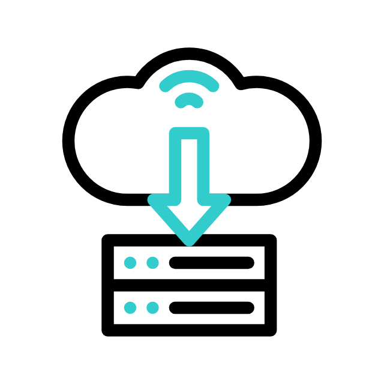
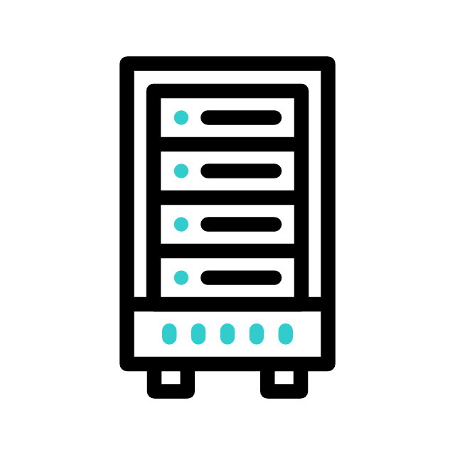

<div align="center">

# Simple File Transfer ✈️

**A user-friendly tool for seamless file and folder sharing.**
<br />
*Share across the internet with a public URL or instantly within your local network.*

</div>

<p align="center">
  
  
  
</p>

---

## ✨ Key Features

- **Intuitive GUI**: No command-line expertise needed. Simple and clean interface.
- **Dual Transfer Modes**:
  - 🌐 **Public Mode**: Generates a secure, temporary `ngrok` URL to share files with anyone, anywhere.
  - 🏠 **Local Mode**: Instantly share files between devices on the same Wi-Fi/LAN network.
- **Smart Folder Handling**: Automatically zips folders for a hassle-free, single-file transfer.
- **Cross-Platform**: Built with Python, runs smoothly on Windows, macOS, and Linux.
- **One-Click Setup**: Includes a `setup.bat` script for Windows to install all dependencies automatically.

---

## 🎬 Showcase

The application operates in two main modes: **Server Mode** (for receiving files) and **Client Mode** (for sending files).

<table align="center">
  <tr>
    <td align="center"><strong>Server Mode (Receiver)</strong><br><em>Generates a URL/IP for sharing.</em></td>
    <td align="center"><strong>Client Mode (Sender)</strong><br><em>Uploads files to the generated address.</em></td>
  </tr>
  <tr>
    <td></td>
    <td></td>
  </tr>
</table>

---

## 🚀 Getting Started

### Prerequisites

- **Python 3.7+** must be installed on your system.
- The `ngrok` service is used for Public Mode. The app guides you through a one-time free API key setup.

### Installation

#### For Windows Users (Recommended)
1.  Download or clone this repository.
2.  Double-click **`setup.bat`**. This script will automatically create a virtual environment and install all required libraries.
3.  Once setup is complete, run the application anytime by double-clicking **`start.bat`**.

<details>
<summary><strong>For macOS / Linux Users (Manual Install)</strong></summary>

1.  Download or clone this repository.
2.  Open your terminal in the project directory.
3.  It's recommended to create a virtual environment:
    ```bash
    python3 -m venv venv
    source venv/bin/activate  # On Windows, use `venv\Scripts\activate`
    ```
4.  Install the dependencies from `requirements.txt`:
    ```bash
    pip install -r requirements.txt
    ```
5.  Run the application:
    ```bash
    python gui2.py
    ```
</details>

---

## 💡 How to Use

The core logic is simple: The person **RECEIVING** files runs the app in **Server Mode**. The person **SENDING** files uses **Client Mode**.

### 🌍 Scenario 1: Sharing Over the Internet (Public URL)

**On the Receiver's Computer:**
1.  **One-Time Setup**:
    - The app will prompt you to configure `ngrok`. Click **"Get API Key (Help)"** to get your free authtoken from the ngrok website.
    - Back in the app, click **"Configure API Key"**, paste your token, and save.
2.  Click **"Start Server"**.
3.  A public URL (e.g., `https://random-name.ngrok-free.app`) will be generated.
4.  Click the **"Copy"** button and send this URL to the other person.

**On the Sender's Computer:**
1.  Switch to **Client Mode**.
2.  Paste the full URL into the **"Address or URL"** box.
3.  Select your file or folder and click **"Upload"**.

### 🏠 Scenario 2: Sharing on a Local Network (LAN/Wi-Fi)

This mode is perfect for quick transfers at home or in the office and **requires no API key**.

**On the Receiver's Computer:**
1.  When prompted about public sharing, choose **"No"** (or simply don't configure an API key).
2.  Click **"Start Server"**.
3.  The app will display a local IP address and port (e.g., `192.168.1.10:8000`).
4.  Click **"Copy"** and send this to the other person on the same network.

**On the Sender's Computer:**
1.  Switch to **Client Mode**.
2.  Enter the IP in the **"Address or URL"** box (e.g., `192.168.1.10`).
3.  Enter the port in the **"Port"** box (e.g., `8000`).
4.  Select your file or folder and click **"Upload"**.

---

## 📂 Project Structure

- `gui2.py`: The main application script containing the GUI and logic.
- `requirements.txt`: A list of required Python libraries for `pip`.
- `setup.bat`: Windows script for easy environment setup.
- `start.bat`: Windows script to run the application.

---

## 📄 License

This project is licensed under the MIT License - see the `LICENSE` file for details.
